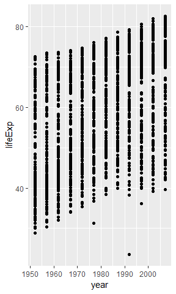

*This is some formatting*

**Some other formats**

- item 1
- item 2


1. list 1
1. list 2


```r
library(gapminder)
library(ggplot2)
library(tidyverse)

data(gapminder)
head(gapminder)
```

<!-- -->


```r
ggplot(data=gapminder, mapping = aes(x=year, y = lifeExp))+
    geom_point()
```

<!-- -->


The largest populaitono f any country in this dataset is 81.757.


**Some other formats**
